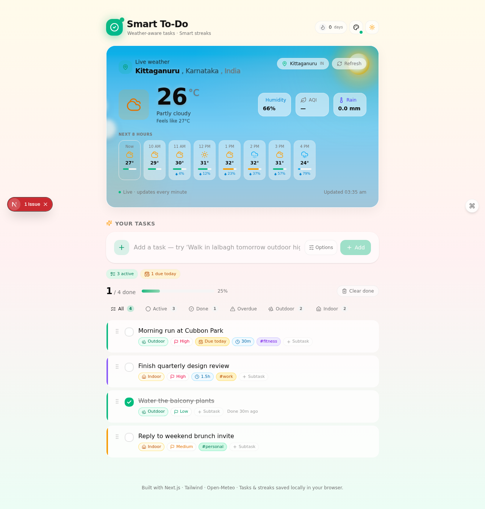

# 🌤️ Smart To-Do

A weather-aware smart to-do list with cinematic animated weather scenes, AQI monitoring, streak tracking, and natural-language task parsing. Built as a passion project to demonstrate modern web animation techniques and thoughtful UX design.



## ✨ Features

### Weather Integration
- **Live weather** for any city worldwide — powered by [Open-Meteo](https://open-meteo.com) (free, no API key required)
- **Air Quality Index (AQI)** with EPA color-coding (Good → Hazardous) and pollutant breakdown (PM2.5, PM10, O₃, NO₂, SO₂)
- **Hourly forecast** — next 8 hours with temperature, precipitation probability, and weather icons
- **Dynamic location search** — search any city, neighborhood, or locality worldwide via [OpenStreetMap Nominatim](https://nominatim.org)
- **Geolocation** — "Use my current location" button for one-tap detection
- **Home button** — snap back to your default location instantly
- **1-minute auto-refresh** — weather updates automatically

### Cinematic Weather Animations
10 distinct animated scenes with 3-layer parallax depth, each matching the current weather:

| Scene | Animation |
|-------|-----------|
| 🌙 Clear Night | 90 twinkling stars (3 parallax layers), glowing moon with craters + atmospheric bloom, nebula gradients, occasional shooting stars |
| ☁️ Cloudy Night | Moon behind clouds, dimmer stars, drifting volumetric clouds |
| ☀️ Clear Sunny Day | Blue sky gradient, HDR sun with radial glow, floating dust motes |
| 🔥 Hot Sunny Day (≥32°C) | Hazy warm-blue sky, intense orange sun, heat shimmer waves, rising sparkles |
| ⛅ Partly Cloudy Day | Blue sky + 5 distinct fluffy cloud shapes drifting with 3D depth |
| ☁️ Overcast Day | Dense gray volumetric clouds with strong top-light/shadow |
| 🌧️ Rain | 70 angled rain streaks (3 layers), splash ripples, stormy sky |
| ⛈️ Thunderstorm | 100 raindrops + SVG lightning bolt with glow + multi-flash sequence |
| ❄️ Snow | 70 rotating snowflakes (3 layers) with drift and glow |
| 🌫️ Fog | 7 volumetric fog layers drifting in alternating directions |

Clouds use CSS-blurred circle clusters (5-7 overlapping white circles per cloud) with three stacked layers (shadow, body, highlight) for natural soft, fluffy edges — the same technique Apple Weather uses.

### Smart To-Do Features
- **Natural-language quick-add** — type *"Hike to nandi hills tomorrow outdoor high #fitness 90min"* and the parser auto-extracts priority, category, due date, estimate, and tags
- **Rich task creation** — due dates, time estimates, tags, 6 color labels, notes, subtasks
- **Weather-aware warnings** — outdoor tasks get a rain warning badge when it's raining
- **Overdue auto-escalation** — overdue tasks automatically display as High priority with a pulsing red ring
- **Streak tracker** — flame badge tracks consecutive days with at least one completed task
- **Confetti celebration** — fires when you hit 100% completion
- **5 accent themes** — Emerald, Violet, Amber, Rose, Sky (recolors the UI instantly)
- **Keyboard shortcuts** — `⌘K` focus add, `/` focus location search, `?` show shortcuts
- **Today summary pills** — contextual counts (active, due today, overdue, outdoor in rain)
- **Light/Dark mode** — with smooth transitions and text readability in both modes
- **localStorage persistence** — tasks, location, streak, and accent saved locally

## 🛠️ Tech Stack

| Category | Technology |
|----------|-----------|
| Framework | [Next.js 16](https://nextjs.org) (App Router) |
| Language | TypeScript 5 |
| Styling | [Tailwind CSS 4](https://tailwindcss.com) |
| UI Components | [shadcn/ui](https://ui.shadcn.com) (New York style) |
| Animation | [Framer Motion](https://www.framer.com/motion/) |
| State | [Zustand](https://zustand-demo.pmnd.rs) (with persist middleware) |
| Icons | [Lucide React](https://lucide.dev) |
| Celebration | [canvas-confetti](https://www.npmjs.com/package/canvas-confetti) |
| Weather API | [Open-Meteo](https://open-meteo.com) (free, keyless) |
| Geocoding | [OpenStreetMap Nominatim](https://nominatim.org) (free, keyless) |

## 🚀 Getting Started

### Prerequisites
- [Node.js](https://nodejs.org/) 18+ or [Bun](https://bun.sh/)
- npm, yarn, pnpm, or bun

### Installation

```bash
# Clone the repository
git clone https://github.com/YOUR_USERNAME/smart-todo.git
cd smart-todo

# Install dependencies
npm install
# or: yarn / pnpm install / bun install

# Run the development server
npm run dev
```

Open [http://localhost:3000](http://localhost:3000) in your browser.

### Build for Production

```bash
npm run build
npm run start
```

## 🔑 Environment Variables

This project uses **only free, keyless APIs** — no API keys or environment variables required!

- **Weather**: [Open-Meteo](https://open-meteo.com) (free, no key)
- **Geocoding**: [OpenStreetMap Nominatim](https://nominatim.org) (free, no key)
- **Persistence**: Browser `localStorage` (no database)

Just clone, install, and run.

## 📁 Project Structure

```
smart-todo/
├── src/
│   ├── app/
│   │   ├── api/
│   │   │   ├── geocode/route.ts        # OpenStreetMap geocoding proxy
│   │   │   ├── reverse-geocode/route.ts # Reverse geocoding for "Use my location"
│   │   │   └── weather/route.ts        # Open-Meteo weather + AQI proxy
│   │   ├── globals.css                 # Tailwind + custom animations
│   │   ├── layout.tsx                  # Root layout with ThemeProvider
│   │   └── page.tsx                    # Main page composition
│   ├── components/
│   │   ├── weather-card.tsx            # Weather display card
│   │   ├── weather/
│   │   │   ├── weather-effects.tsx     # 10 cinematic animated scenes
│   │   │   ├── location-search.tsx     # City search dropdown + geolocation
│   │   │   └── hourly-forecast.tsx     # 8-hour forecast strip
│   │   ├── todos/
│   │   │   ├── add-todo.tsx            # Task creation form with NLP
│   │   │   ├── todo-item.tsx           # Expandable task card with subtasks
│   │   │   ├── todo-list.tsx           # Task list with filters
│   │   │   ├── filter-tabs.tsx         # All/Active/Done/Overdue/Outdoor/Indoor
│   │   │   └── stats-bar.tsx           # Progress bar + overdue chip
│   │   ├── streak-badge.tsx            # Flame streak tracker
│   │   ├── accent-picker.tsx           # 5-color theme picker
│   │   ├── keyboard-shortcuts.tsx      # ⌘K / / ? shortcuts + help overlay
│   │   ├── today-summary-pill.tsx      # Contextual count pills
│   │   ├── theme-toggle.tsx            # Light/dark toggle
│   │   └── ui/                         # shadcn/ui components
│   ├── hooks/
│   │   ├── use-bangalore-weather.ts    # Weather fetch hook (1-min polling)
│   │   ├── use-streak-watcher.ts       # Streak recording
│   │   └── use-confetti-on-all-done.ts # Celebration trigger
│   ├── lib/
│   │   ├── weather.ts                  # WMO weather code → icon/label mapping
│   │   ├── aqi.ts                      # EPA AQI → color/label mapping
│   │   ├── nlp-parser.ts               # Natural-language task parser
│   │   └── todo-helpers.ts             # Due date + color helpers
│   └── store/
│       ├── todo-store.ts               # Zustand todo store (localStorage)
│       └── location-store.ts           # Zustand location store
├── public/
│   ├── hero-screenshot.png
│   └── logo.svg
├── .gitignore
├── LICENSE
└── README.md
```

## ⌨️ Keyboard Shortcuts

| Shortcut | Action |
|----------|--------|
| `⌘K` / `Ctrl+K` | Focus the new task input |
| `/` | Open location search |
| `?` | Show keyboard shortcuts help |
| `Esc` | Close any open dialog |

## 🎨 NLP Quick-Add Examples

The natural-language parser recognizes:

| Input | Parsed Output |
|-------|--------------|
| `Walk in lalbagh tomorrow outdoor high #fitness 30min` | Outdoor · High priority · Due tomorrow · 30min estimate · #fitness tag |
| `Submit report today urgent #work 1.5hr` | Indoor · High priority · Due today · 90min estimate · #work tag |
| `Brunch next week low` | Indoor · Low priority · Due in 7 days |
| `Call mom on friday` | Indoor · Due next Friday (preposition "on" auto-stripped) |
| `Submit report by tomorrow` | Indoor · Due tomorrow (preposition "by" auto-stripped) |

Detected fields appear as live "Smart parse" hint chips under the input.

## 🌍 API Reference

This project uses three free, keyless APIs:

### [Open-Meteo](https://open-meteo.com)
- Weather forecast (current + hourly)
- Air quality (US EPA AQI + pollutants)
- No API key, no registration, 10k requests/day

### [OpenStreetMap Nominatim](https://nominatim.org)
- Forward geocoding (city name → lat/lon)
- Reverse geocoding (lat/lon → city name)
- No API key, 1 req/sec rate limit (please respect their [usage policy](https://operations.osmfoundation.org/policies/nominatim/))

All API calls are proxied through Next.js edge API routes to avoid CORS issues and enable server-side caching.

## 🤝 Contributing

Contributions are welcome! Please see [CONTRIBUTING.md](CONTRIBUTING.md) for guidelines.

1. Fork the repository
2. Create your feature branch (`git checkout -b feature/amazing-feature`)
3. Commit your changes (`git commit -m 'Add amazing feature'`)
4. Push to the branch (`git push origin feature/amazing-feature`)
5. Open a Pull Request

## 📝 License

This project is licensed under the MIT License — see the [LICENSE](LICENSE) file for details.

## 🙏 Acknowledgments

- [Open-Meteo](https://open-meteo.com) for the free weather API
- [OpenStreetMap](https://www.openstreetmap.org) for the free geocoding
- [shadcn/ui](https://ui.shadcn.com) for the beautiful component library
- [Framer Motion](https://www.framer.com/motion/) for the animation engine
- [Apple Weather](https://weather.apple) for the animation inspiration

---

⭐ If you like this project, please give it a star on GitHub!
